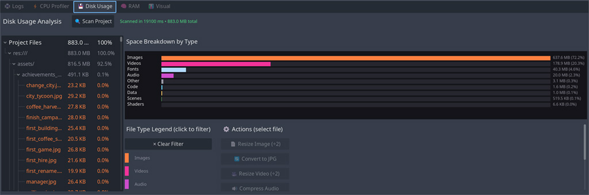

	

# ProProfiler
_Lightweight Godot addon that centralizes logs, inspects disk usage, and provides simple runtime profiling tools for development._

## Requirements
[Godot 4.5](https://godotengine.org/releases/4.5/) or newer.
The `Logs` tab relies on engine support introduced in: https://github.com/godotengine/godot/pull/91006.

## Quick install
- Place the `proprofiler` folder under your project's `addons/` folder.
- Enable the plugin: Project -> Project Settings -> Plugins -> enable `ProProfiler`.

----

## Overview (Tabs)
### Logs
- Centralizes editor and runtime logs in one place so you can search, filter, copy and inspect messages without switching windows.
- Categories: use short square-bracket tags in your logs like `[NETWORK]`, `[SAVE]`, `[AI]`, `[UI]` — feature/area
- Log Inspector features:
- Text search, severity & category filters, and time range selection.
- Click a log to see the full stack/backtrace and related metadata.
- Capture runtime logs from connected game instances (requires runtime logger enabled).

### CPU Profiler
*The CPU Profiler tab is currently not functional due to Godot's addon API limitations.*
- WIP

### Disk Usage
- Scans project folders to produce a breakdown by file type and folder. Useful to quickly find oversized assets (textures, audio, video).
- Features include file-type filters, per-file actions (resize/convert suggestions), and a treemap/table view for drill-down.

Example — Disk Usage

*Disk Usage scan results (project breakdown by file type and sizes).*

## Usage
- Enable the plugin and open the addon's UI from the Editor, or use the in-game controls for runtime captures.
- Use `Logs` to gather recent runtime messages. Use `Disk Usage` to scan project folders and identify large assets.

----
## Contributing
- Contributions welcome. Follow the project's style.
- Keep PRs focused, include tests or manual verification steps, and document behavioral changes in the PR description.

## License
- See the repository `LICENSE` file: [LICENSE](../../LICENSE)

## Support
- Open issues and PRs on the repository; include Godot version and reproduction steps when relevant.

## Notes
*This addon is targeted at development workflows. Keep it disabled in release exports.*

